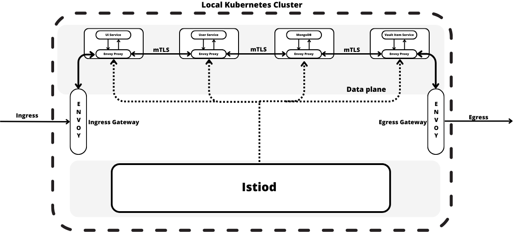

# Description of the system

This system is decomposed into 3 microservices developed with Spring Boot 3.0 using GraalVM 22.3.0 (JDK17).
These components are deployed on a local Kubernetes cluster (with Docker Container Runtime) on which an Istio service mesh has been created, along with a MongoDB instance.

The 3 components are:
-  Main (UI Service): this service is a Java Spring Boot Application that is responsible for the interaction with the user, exposing the main functionalities of the whole system.
-  Users Service: this service is a Java Spring Boot Application that is responsible for the registration and the authentication of an user and storing these values on the MongoDB instance.
-  Vault Item Service: this service is Kotlin Spring Boot Application that is responsible for creating mappings between items created by the user and the assets registered on the Hyperledger Fabric local network.

The Main UI Service and Users Service images inside the local Kubernetes cluster contain the respective JAR applications, along with the Oracle JDK.
While the Vault Item Service image contains a native executable of a Spring Boot application developed with Kotlin.

# Architecture of the service mesh
